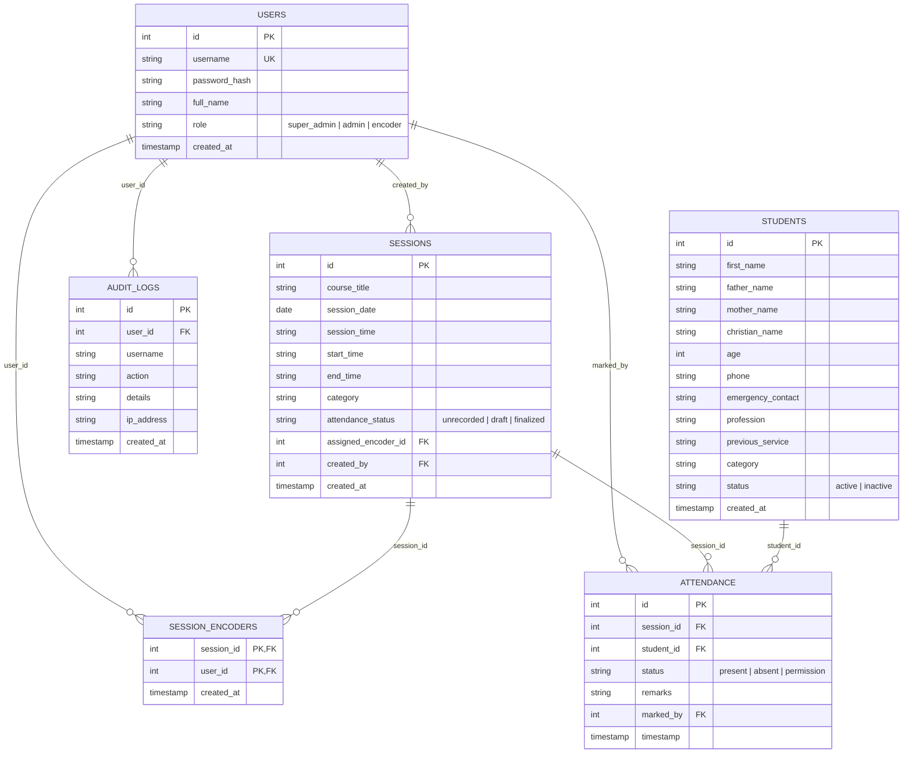

# 📖 Bete Yared Sunday School Attendance & Student Management System
## Complete System Functionality Specification & User Guide

---

## 📑 Table of Contents
1. [System Overview & Key Highlights](#1-system-overview--key-highlights)
2. [Role-Based Access Control (RBAC) Matrix](#2-role-based-access-control-rbac-matrix)
3. [Core Modules & Functionalities](#3-core-modules--functionalities)
   - [3.1 Dashboard & Visual Analytics](#31-dashboard--visual-analytics)
   - [3.2 Student Directory & Family Grouping](#32-student-directory--family-grouping)
   - [3.3 Bulk Excel/CSV Student Import](#33-bulk-excelcsv-student-import)
   - [3.4 Session Scheduling & Recurrence Engine](#34-session-scheduling--recurrence-engine)
   - [3.5 Multi-Encoder Assignment & Session Editing](#35-multi-encoder-assignment--session-editing)
   - [3.6 Attendance Recording & Finalization Workflow](#36-attendance-recording--finalization-workflow)
   - [3.7 Cross-Category Attendance (Make-up Classes)](#37-cross-category-attendance-make-up-classes)
   - [3.8 3-Consecutive Absent Follow-up Engine](#38-3-consecutive-absent-follow-up-engine)
   - [3.9 Category Matrix & Exporting](#39-category-matrix--exporting)
   - [3.10 Security, Audit Trail & User Management](#310-security-audit-trail--user-management)
4. [Step-by-Step User Manual](#4-step-by-step-user-manual)
   - [Guide for Encoders (መዝጋቢዎች)](#guide-for-encoders)
   - [Guide for Administrators (አስተዳዳሪዎች)](#guide-for-administrators)
   - [Guide for Super Administrators (ዋና አስተዳዳሪ)](#guide-for-super-administrators)
5. [Database Architecture & Entity Relationship](#5-database-architecture--entity-relationship)

---

## 1. System Overview & Key Highlights

The **Bete Yared Sunday School Management System** is a purpose-built, cloud-ready web application engineered to modernize Sunday School operations, automate student attendance tracking, facilitate proactive pastoral follow-up, and organize family records.

### Key Highlights:
- 🌐 **Full Bilingual Support**: Instant toggling between **English** and **Amharic (አማርኛ)** across all views, notifications, and export reports.
- 🕒 **Ethiopian Dual-Time System**: Real-time conversion between standard 24-hour / 12-hour UTC/EAT and local **Ethiopian Time** (e.g., `09:00 - 11:00` &harr; `ከጠዋቱ 3:00 - 5:00 ሰዓት`).
- 🔒 **Data Protection & Draft Locking**: Attendance can be saved as a temporary draft or finalized; finalized attendance is locked for encoders to prevent unauthorized historical changes.
- 👨‍👩‍👧‍👦 **Automated Sibling & Family Grouping**: Automatically identifies and groups siblings across different grades and categories using household parental matching.
- 🚨 **Automated 3-Consecutive-Absent Alert Engine**: Proactively detects and flags students who missed 3 consecutive sessions in their class with 1-click direct calling buttons.
- 🔄 **Cross-Category Attendance (Make-up Classes)**: Enables students to attend make-up sessions in other categories without creating double absences or conflicting reports.
- 🕵️ **Super Admin Confidentiality & Activity Audit Trail**: Complete immutable logging of system activity while keeping privileged administrative roles discrete.

---

## 2. Role-Based Access Control (RBAC) Matrix

| Feature / Action | Super Admin | Administrator | Encoder (መዝጋቢ) |
| :--- | :---: | :---: | :---: |
| **View Dashboard Analytics** | ✅ Full | ✅ Full | ✅ Summary |
| **Register & Edit Students** | ✅ Yes | ✅ Yes | ❌ Read-Only |
| **View Sibling & Family Directory** | ✅ Yes | ✅ Yes | ❌ No |
| **Bulk Import Students via Excel** | ✅ Yes | ❌ No | ❌ No |
| **Create Sessions & Recurrence Series** | ✅ Yes | ✅ Yes | ❌ No |
| **Assign / Re-assign Multiple Encoders** | ✅ Yes | ✅ Yes | ❌ No |
| **Edit Upcoming Sessions** | ✅ Yes | ✅ Yes | ❌ No |
| **Edit Past Sessions** | ❌ Locked | ❌ Locked | ❌ Locked |
| **Continue / Copy Sessions** | ✅ Yes | ✅ Yes | ❌ No |
| **Delete Empty Sessions** | ✅ Yes | ✅ Yes | ❌ No |
| **Delete Sessions with Recorded Attendance** | ✅ Yes (Override) | ❌ Blocked | ❌ Blocked |
| **Record Assigned Session Attendance** | ✅ Yes | ✅ Yes | ✅ Assigned Only |
| **Save Temporary Drafts** | ✅ Yes | ✅ Yes | ✅ Yes |
| **Finalize & Lock Attendance** | ✅ Yes | ✅ Yes | ✅ Yes |
| **Edit Finalized / Locked Attendance** | ✅ Yes | ✅ Yes | ❌ Locked |
| **Add Cross-Category Student to Session** | ✅ Yes | ✅ Yes | ✅ Yes |
| **View & Act on 3-Absent Alerts** | ✅ Yes | ✅ Yes | ❌ No |
| **View Category Matrix & Export** | ✅ Yes | ✅ Yes | ❌ No |
| **User Management & Password Resets** | ✅ Yes | ✅ Yes (Encoders) | ❌ No |
| **View Audit Trail Activity Logs** | ✅ Yes (Exclusive) | ❌ Hidden | ❌ Hidden |

---

## 3. Core Modules & Functionalities

### 3.1 Dashboard & Visual Analytics
- **Live Statistics Cards**: Real-time counters for **Total Students**, **Active Students**, **Total Sessions Held**, and **Overall Attendance Rate (%)**.
- **Category Breakdown Chart**: Visual representation of student distribution across Sunday School departments (*Child, Grades 1-12, Teens, Youth, Adult*).
- **Recent Sessions Table**: Quick-access listing of recent classes with marked attendance tallies.

### 3.2 Student Directory & Family Grouping
- **Rich Student Profiles**: Tracks First Name, Father's Name, Mother's Name, Christian (Baptismal) Name, Age, Phone, Emergency Contact, Profession, Previous Church Service, Category, and Active/Inactive status.
- **Family & Sibling Directory**:
  - Automatically correlates students having identical Father and Mother names.
  - Displays total multi-child households, parents' names, and sibling rosters across classes.
- **Student History Modal**: Shows complete attendance timeline, attendance rate, total sessions attended, and status history for any selected student.

### 3.3 Bulk Excel/CSV Student Import
- Dedicated module for importing hundreds of student records simultaneously.
- **Template Download**: Provides a pre-formatted Excel template (`.xlsx` / `.csv`) with sample headers.
- **Pre-Upload Validation**: Checks for missing mandatory fields (First name, Father's name, Category) and filters out test template rows before saving.
- **Detailed Error Reporting**: Identifies any invalid rows so corrections can be made without losing valid records.

### 3.4 Session Scheduling & Recurrence Engine
- **Single & Series Creation**: Supports one-time sessions, weekly recurring series (e.g. every Sunday for 4, 8, 12, 16, or 24 weeks), monthly recurrence, or custom picked dates.
- **Time Collision Prevention**: Validates that no two sessions for the same category overlap in time on any given date.
- **Ethiopian Dual-Time Converter**: Automatically calculates and previews Ethiopian hours alongside standard 24-hour time.
- **Continue / Copy Session**: 1-click duplicating to next week (+7 days), next month (+1 month), or recurring batches with pre-filled metadata.

### 3.5 Multi-Encoder Assignment & Session Editing
- **Multiple Encoders per Session**: Admins can assign one or more specific encoder accounts to each session.
- **Confidential & Scoped Access**: Encoders only see sessions assigned to them.
- **Upcoming Session Editing**: Admins can adjust title, date, time, category, notes, and re-assign encoders for any upcoming session (`session_date >= today`).
- **Past Session Protection**: Past sessions cannot have their schedule altered, preserving historical audit accuracy.

### 3.6 Attendance Recording & Finalization Workflow
- **Attendance Statuses**:
  - `Present` (ተገኝቷል) - Green badge
  - `Absent` (ቀረ) - Red badge
  - `Permission` (ፈቃድ) - Yellow badge with optional explanatory remarks.
- **1-Click Actions**: "Mark All Present" button for rapid marking.
- **Draft vs. Finalized**:
  - **Save Draft (ጊዜያዊ ረቂቅ)**: Allows encoders to save progress and resume later.
  - **Finalize & Save (አጽድቀህ መዝግብ)**: Locks the attendance sheet for encoders and marks the session finalized.
- **Future Date Guard**: Attendance cannot be recorded for future dates before the session actually takes place.

### 3.7 Cross-Category Attendance (Make-up Classes)
- When a student cannot attend their regular class (e.g., Youth class) but attends another session (e.g., Teens or Grade 12):
  - The encoder uses **"+ Add Student from Other Category"** in the active session.
  - The student is added and marked `Present` with a distinct `Cross-Category` badge.
  - In their home category's attendance sheet for that date, the student's entry is marked with *"Attended in other class"* (disabled for duplicate marking).
  - The attendance counts toward their overall attendance rate and resets the 3-consecutive-absent counter.

### 3.8 3-Consecutive Absent Follow-up Engine
- Automatically scans historical attendance windows by category.
- Flags any student who missed the **last 3 consecutive held sessions** in their category.
- Displays last date present, total consecutive absences, and provides **1-Click Call Buttons** to telephone the student or their emergency parent contact immediately.

### 3.9 Category Matrix & Exporting
- Provides a bird's-eye matrix spreadsheet view of every student vs. every held session date with color-coded markers (`P`, `A`, `L`).
- **Future Date Handling**: Future sessions that have not yet occurred are represented cleanly without triggering false absences.
- **1-Click Excel Export**: Exports styled, filtered matrices directly to Excel (`.xlsx`) for parish leadership reports.

### 3.10 Security, Audit Trail & User Management
- **Password Management**: Users can update their own passwords with minimum 6-character complexity; Admins can reset forgotten credentials.
- **Audit Logs (Super Admin Only)**: Immutable chronological log tracking all logins, student creations/edits/deletions, session updates, attendance submissions, and user modifications with IP addresses and timestamps.

---

## 4. Step-by-Step User Manual

### Guide for Encoders (መዝጋቢዎች)
1. **Sign In**: Log in with your assigned username and password.
2. **Access Assigned Sessions**: In the **Sessions** tab, you will see the sessions assigned to you with an *"Assigned to You"* badge.
3. **Record Attendance**:
   - Click **Take Attendance (መገኘት መዝግብ)** on the session.
   - Use **Mark All Present** or toggle individual students between *Present*, *Absent*, or *Permission*.
   - Add notes/remarks for permissions if applicable.
4. **Handle Make-up Students**:
   - If a student from another class attends, click **"+ Add Student from Other Category"**, search their name, and add them.
5. **Save or Finalize**:
   - Click **Save Draft** if you need to continue later.
   - Click **Finalize & Save** once complete.

---

### Guide for Administrators (አስተዳዳሪዎች)
1. **Student Registration**:
   - Go to **Students** &rarr; click **"+ Register New Student"**.
   - Fill in personal, parental, and contact details & select Category.
2. **Session Scheduling**:
   - Go to **Sessions** &rarr; click **"+ Create New Session"**.
   - Enter course title, date, start & end time (view Ethiopian time preview), and select category.
   - In **Assigned Encoders**, check the encoders responsible for taking attendance.
   - Choose recurrence (e.g. *Weekly for 12 weeks*) if creating a series.
3. **Editing & Re-assigning**:
   - Click the **Edit (<i class="fa-solid fa-pen-to-square"></i>)** button on any upcoming session to change time, title, or encoder assignments.
4. **Follow-up on Absences**:
   - Go to **3-Absent Alerts** to review students needing pastoral follow-up and call them directly using the quick-dial buttons.
5. **Generate Reports**:
   - Open **Category Matrix & Export** to inspect term attendance rates and export Excel files.

---

### Guide for Super Administrators (ዋና አስተዳዳሪ)
1. **Bulk Import Students**:
   - Navigate to **Category Matrix & Export** &rarr; **"Import from Excel/CSV"**.
   - Download the template, populate records, upload, and review the validation preview before confirming.
2. **User Account Administration**:
   - Go to **User Management** to create new Admin and Encoder accounts or reset passwords.
3. **Audit Trail Inspection**:
   - Open **Audit Logs** to view system actions, administrative changes, and login activities.

---

## 5. Database Architecture & Entity Relationship

