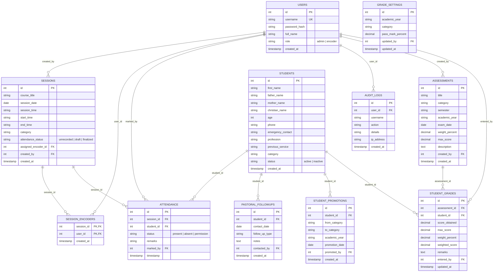

# 📖 Bete Yared Sunday School Management System
## Complete System User Manual & Functional Documentation

---

## 📑 Table of Contents
1. [System Overview & Key Capabilities](#1-system-overview--key-capabilities)
2. [Role-Based Access Control (RBAC) Matrix](#2-role-based-access-control-rbac-matrix)
3. [Core Modules & Functional Specifications](#3-core-modules--functional-specifications)
   - [3.1 Dashboard & Visual Analytics](#31-dashboard--visual-analytics)
   - [3.2 Student Directory & Sibling Grouping](#32-student-directory--sibling-grouping)
   - [3.3 Bulk Excel / CSV Student Import](#33-bulk-excel--csv-student-import)
   - [3.4 Session Scheduling & Recurrence Engine](#34-session-scheduling--recurrence-engine)
   - [3.5 Multi-Encoder Assignment & Scoped Access](#35-multi-encoder-assignment--scoped-access)
   - [3.6 Attendance Taking & Locking Rules](#36-attendance-taking--locking-rules)
   - [3.7 Cross-Category Attendance (Make-up Classes)](#37-cross-category-attendance-make-up-classes)
   - [3.8 3-Consecutive Absent Urgent Alerts & Pastoral Care](#38-3-consecutive-absent-urgent-alerts--pastoral-care)
   - [3.9 Inactive Student Tracking & Reactivation](#39-inactive-student-tracking--reactivation)
   - [3.10 Annual Student Academic Promotions](#310-annual-student-academic-promotions)
   - [3.11 Grade & Assessment Management System](#311-grade--assessment-management-system)
   - [3.12 Gradebook Summary Matrix & Excel Export](#312-gradebook-summary-matrix--excel-export)
   - [3.13 Batch Report Card Print System](#313-batch-report-card-print-system)
   - [3.14 Category Attendance Matrix & Reporting](#314-category-attendance-matrix--reporting)
   - [3.15 User Management & Account Security](#315-user-management--account-security)
4. [Step-by-Step User Manuals](#4-step-by-step-user-manuals)
   - [4.1 Guide for Attendance Encoders (መዝጋቢዎች)](#41-guide-for-attendance-encoders-መዝጋቢዎች)
   - [4.2 Guide for System Administrators (አስተዳዳሪዎች)](#42-guide-for-system-administrators-አስተዳዳሪዎች)
5. [Database Architecture & Entity Relationship](#5-database-architecture--entity-relationship)

---

## 1. System Overview & Key Capabilities

The **Bete Yared Sunday School Management System** is a purpose-built, modern web application designed to streamline church Sunday school administration, automate attendance tracking, monitor academic evaluations, organize family records, and facilitate proactive pastoral care.

```
+----------------------------------------------------------------------------------------------------+
|                                    BETE YARED SUNDAY SCHOOL SYSTEM                                 |
+------------------------------------+----------------------------------+----------------------------+
|   👥 Student & Family Records      |   📅 Attendance & Scheduling     |   🎓 Gradebook & Cards     |
|   - 10-field student profiles      |   - Ethiopian Dual-Time engine   |   - Assessment weights     |
|   - Automated sibling matching     |   - Multi-encoder assignment     |   - Batch mark entry       |
|   - Batch Excel/CSV import         |   - Draft & finalized locking    |   - Class ranking & matrix |
|   - Annual academic promotion      |   - Cross-category make-ups      |   - Pass/Fail thresholds   |
|   - Inactive student registry      |   - 3-absent quick-dial alerts   |   - Batch 1-page reports   |
+------------------------------------+----------------------------------+----------------------------+
```

### Key Capabilities:
- 🌐 **Full Bilingual Support**: Instant toggling between **English** and **Amharic (አማርኛ)** across all screens, modals, tables, badges, and export files.
- 🕒 **Ethiopian Dual-Time Engine**: Seamless real-time conversion between standard 24-hour/12-hour international time and local **Ethiopian Time** (e.g., `09:00 - 11:00 EAT` &harr; `ከጠዋቱ 3:00 - 5:00 ሰዓት`).
- 🔒 **Data Protection & Draft Locking**: Attendance can be saved as a temporary working draft or finalized; once finalized, records are locked for encoders to guarantee audit integrity.
- 👨‍👩‍👧‍👦 **Automated Sibling & Family Grouping**: Automatically correlates and groups siblings across different grades (Child through Youth) based on household parentage.
- 🚨 **Automated 3-Consecutive-Absent Alert Engine**: Proactively detects students who missed 3 consecutive sessions in their class with direct 1-click phone dial buttons for immediate pastoral outreach.
- 🔄 **Cross-Category Attendance (Make-up Classes)**: Permits students attending make-up sessions in other classes to receive credit while disabling duplicate marking in their home class.
- 📊 **Pure-Numerical Grade & Assessment Management**: Configurable weighted tests, batch mark entry sheets, configurable passing thresholds, class ranking, and 1-click batch single-page printable report cards with official church branding.

---

## 2. Role-Based Access Control (RBAC) Matrix

The system operates with role segregation ensuring operational security, scoped data visibility, and workflow clarity between administrative staff and attendance encoders.

| System Module / Capability | Administrator (አስተዳዳሪ) | Attendance Encoder (መዝጋቢ) |
| :--- | :---: | :---: |
| **Dashboard Analytics & KPIs** | ✅ Full Analytics | ✅ Summary View |
| **Student Registration & Profile Editing** | ✅ Full Control | ❌ Read-Only |
| **Family & Sibling Directory** | ✅ Full Access | ❌ Hidden |
| **Bulk Excel / CSV Student Import** | ✅ Full Access | ❌ Hidden |
| **Session Scheduling & Recurrence Engine** | ✅ Full Control | ❌ Hidden |
| **Assign Multiple Encoders to Sessions** | ✅ Full Control | ❌ Hidden |
| **Edit Upcoming Sessions** (`session_date >= today`) | ✅ Yes (Upcoming Only) | ❌ Hidden |
| **Edit Past Held Sessions** | ❌ Locked for History | ❌ Locked |
| **Take Attendance for Assigned Sessions** | ✅ All Sessions | ✅ Assigned Sessions Only |
| **Save Temporary Draft Attendance** | ✅ Yes | ✅ Yes |
| **Finalize & Lock Attendance Sheet** | ✅ Yes | ✅ Yes |
| **Modify Finalized / Locked Attendance** | ✅ Authorized Edit | ❌ Locked (Contact Admin) |
| **Add Cross-Category Student (Make-up)** | ✅ Yes | ✅ Yes |
| **3-Consecutive Absent Urgent Alerts** | ✅ View & Direct Dial | ❌ Hidden |
| **Inactive Student Management & Reactivation** | ✅ Full Control | ❌ Hidden |
| **Annual Student Academic Promotion** | ✅ Full Control | ❌ Hidden |
| **Create & Configure Assessments** | ✅ Full Control | ❌ Hidden |
| **Configure Minimum Pass/Fail Threshold** | ✅ Full Control | ❌ Hidden |
| **Batch Enter & Update Student Marks** | ✅ Full Control | ❌ Hidden |
| **Gradebook Summary Matrix & Excel Export** | ✅ Full Control | ❌ Hidden |
| **Batch Report Card Generation & Printing** | ✅ Full Control | ❌ Hidden |
| **Category Attendance Matrix & Export** | ✅ Full Control | ❌ Hidden |
| **User Management & Password Resets** | ✅ Full Control | ❌ Own Password Only |

---

## 3. Core Modules & Functional Specifications

### 3.1 Dashboard & Visual Analytics
- **Summary KPI Cards**: Live counters displaying **Total Registered Students**, **Active Students**, **Total Sessions Held**, and **Overall Parish Attendance Rate (%)**.
- **Category Breakdown Chart**: Visual bar visualization showing student enrollment distributed across Sunday school categories (*Child, Grades 1–12, Teens, Youth, Adult*).
- **Recent Sessions Feed**: Direct-access table displaying the most recently conducted sessions, attendance completion status, and encoder details.

### 3.2 Student Directory & Sibling Grouping
- **Comprehensive Profile Fields**:
  - Personal Information: First Name, Father's Name, Mother's Name, Christian (Baptismal) Name, Age, Profession/School, Previous Church Service.
  - Contact Information: Primary Phone, Emergency / Guardian Contact Phone.
  - Academic Classification: Category (Child, Grade 1 to 12, Teens, Youth, Adult) and Status (Active / Inactive).
- **Automated Sibling & Family Matching**:
  - The system continuously indexes students with matching `father_name` and `mother_name`.
  - The **Families** directory aggregates multi-child households, showing all siblings, their individual grades, and parent phone numbers for unified pastoral communication.
- **Student History Timeline**:
  - Displays any student's complete attendance record, attended dates, missed sessions, permission notes, cumulative attendance percentage, and assessment results.

### 3.3 Bulk Excel / CSV Student Import
- **Pre-formatted Template**: Provides a standardized `.xlsx` / `.csv` template with sample headers.
- **Client-Side Validation**: Automatically verifies required fields (First Name, Father's Name, Category), cleans whitespace, and ignores template sample rows.
- **Pre-Import Verification Grid**: Displays a preview table highlighting valid records in green and flagged rows before writing to the database.

### 3.4 Session Scheduling & Recurrence Engine
- **Single & Series Scheduling**:
  - Schedule one-time classes or generate weekly/monthly recurring batches (4, 8, 12, 16, or 24 weeks).
- **Time Collision Prevention**:
  - Validates that no two sessions for the same category overlap on the same date and time range.
- **Ethiopian Dual-Time Converter**:
  - As time is entered in international 24-hour format, the system dynamically calculates and displays the corresponding Ethiopian time (e.g. `14:00 - 16:00` &rarr; `ከቀኑ 8:00 - 10:00 ሰዓት`).
- **Continue / Copy Session**:
  - 1-click cloning of any session to next week (+7 days) or next month (+1 month) with all encoders and course information pre-filled.

### 3.5 Multi-Encoder Assignment & Scoped Access
- **Multiple Encoders per Session**:
  - Administrators can assign one or more specific encoder user accounts to any session.
- **Scoped Visibility for Encoders**:
  - Encoders only see sessions explicitly assigned to them, labeled with a green *"Assigned to You"* badge.
- **Upcoming Session Editing**:
  - Administrators can modify session dates, times, titles, categories, and encoder assignments for any upcoming session (`session_date >= today`).
- **Past Session Historical Integrity**:
  - Past held sessions cannot have their schedule altered, preserving audit accuracy.

### 3.6 Attendance Taking & Locking Rules
- **Three Core Attendance Statuses**:
  - `Present` (ተገኝቷል) - Green badge
  - `Absent` (ቀረ) - Red badge
  - `Permission` (ፈቃድ) - Amber badge with mandatory/optional note explaining the absence reason.
- **Rapid Operations**:
  - **Mark All Present**: 1-click button to mark the entire class present instantly.
- **Draft vs. Finalized Workflows**:
  - **Save Draft (ጊዜያዊ ረቂቅ)**: Stores current progress so the encoder can step away and resume marking later.
  - **Finalize & Save (አጽድቀህ መዝግብ)**: Formally closes the session, locks the sheet from further edits by encoders, and calculates final attendance metrics.
- **Future Date Guard**:
  - Attendance cannot be marked for dates in the future before class occurs.

### 3.7 Cross-Category Attendance (Make-up Classes)
When a student is unable to attend their regular class and attends a make-up class in another category:
1. The encoder in the active make-up session clicks **"+ Add Student from Other Category"**.
2. The student is searched and added, marked `Present`, and tagged with an amber `Cross-Category` badge.
3. In their home category's attendance sheet for that date, their entry is marked *"Attended in other class"* (disabled for duplicate attendance taking).
4. The student receives full credit toward their overall attendance rate, and their 3-consecutive-absent counter is reset.

### 3.8 3-Consecutive Absent Urgent Alerts & Pastoral Care
- **Continuous Sliding Window**:
  - Automatically scans historical attendance by class to flag students who missed the **last 3 consecutive held sessions** in their home category.
- **Direct Phone Outreach**:
  - Displays the student's profile, last attended date, total missed sessions, and provides **1-Click Call Buttons**:
    - **Call Student**: Telephones the student directly.
    - **Call Emergency**: Telephones the parent / guardian emergency contact.
- **Pastoral Resolution**:
  - Administrators can log contact notes (e.g. sick, travel, family issue) directly to the student's pastoral file.

### 3.9 Inactive Student Tracking & Reactivation
- **Dedicated Inactive Registry**:
  - Lists all archived or inactive students who have moved away or paused attendance.
- **1-Click Reactivation**:
  - Administrators can reactivate an inactive student at any time, returning them to their active category roster without losing prior attendance or grade history.

### 3.10 Annual Student Academic Promotions
- **Year-End Transition Engine**:
  - Enables bulk or individual promotion of students to the next grade level (e.g. Grade 1 &rarr; Grade 2 ... Grade 12 &rarr; Teens &rarr; Youth).
- **Promotion Audit History**:
  - Records every promotion event with timestamp, previous category, new category, academic year, and promoting administrator.

### 3.11 Grade & Assessment Management System
- **Assessment Creation & Weighting**:
  - Configure assessments categorized by:
    - **Category**: Specific Sunday school grade (e.g., Youth, Grade 8).
    - **Semester**: 1st Semester (1ኛ መንፈቀ ዓመት), 2nd Semester (2ኛ መንፈቀ ዓመት), or Summer Term (የበጋ ትምህርት).
    - **Academic Year**: Dropdown options spanning `2026 ዓ.ም.` down to `2018 ዓ.ም.` (default set to `2025 ዓ.ም.`).
    - **Exam Date**: Date picker with integrated Ethiopian calendar converter.
    - **Assessment Weight (%)**: Weighting percentage (e.g., 100% for a single comprehensive exam, or 20%, 30%, 50% for multiple tests).
    - **Max Score Points**: Raw point scale (e.g. out of 100, 50, or 30).
- **Batch Mark Entry Sheet (ሞላ/ግቤት)**:
  - 1-click opens a streamlined spreadsheet-style modal listing every student enrolled in the category.
  - Allows rapid tab-and-enter score inputs with instant score preview, max-score validation, and single-click batch saving.
- **Configurable Pass/Fail Threshold**:
  - Administrators can configure the minimum pass mark percentage (e.g. `50%`) either globally or per specific category.
- **Pure Numerical Grading**:
  - The system relies strictly on numerical marks, weighted percentages, class rank, and binary **Pass (አልፏል)** / **Fail (አላለፈም)** status without arbitrary letter grades (A, B, C, D).

### 3.12 Gradebook Summary Matrix & Excel Export
- **Comprehensive Gradebook Matrix**:
  - Displays a complete cross-tabulation table of all enrolled students against all semester assessments in that category.
  - Automatically calculates:
    - Raw score obtained per assessment.
    - Weighted contribution of each assessment.
    - Total weighted score (%) achieved.
    - Overall Class Rank (ደረጃ) sorted from highest to lowest.
    - Status: **አልፏል (Pass)** in green or **አላለፈም (Fail)** in red.
- **1-Click Excel Export**:
  - Exports the fully styled gradebook matrix directly to a formatted Microsoft Excel (`.xlsx`) spreadsheet for parish archives and leadership meetings.

### 3.13 Batch Report Card Print System
- **Executive Single-Page Layout**:
  - Generates individual, elegant, ink-friendly monochrome report cards formatted to fit exactly **1 student per page** on standard A4 paper (`page-break-after: always`).
- **Official Branding & Details**:
  - Includes the official church logo (`images/logo.png`), parish title, student full name, baptismal name, category, semester, academic year, and exam breakdown table.
- **Summary & Evaluation Section**:
  - Displays Total Marks, Weighted Percentage, Class Rank (ደረጃ), Overall Result (አልፏል / አላለፈም), and official signature lines for the Teacher and Head Administrator.
- **Batch Print / PDF Export**:
  - Generates all report cards for the selected class simultaneously, allowing 1-click printing or "Save as PDF" via the browser print dialog.

### 3.14 Category Attendance Matrix & Reporting
- **Bird's-Eye Attendance Matrix**:
  - Displays a grid of every student in a category across every held session date with color-coded status indicators (`P` for Present, `A` for Absent, `L` for Permission).
- **Excel Matrix Export**:
  - Exports the complete attendance record to `.xlsx` with calculated attendance percentages per student.

### 3.15 User Management & Account Security
- **Administrator & Encoder Accounts**:
  - Administrators can create new user accounts, assign roles, view last login timestamps, and reset forgotten passwords.
- **Self-Service Password Updates**:
  - Every user can change their own password at any time via the user profile badge in the navigation bar.
- **Audit Logging**:
  - Secure chronological log tracking all system events (logins, student registrations, attendance finalizations, and grade modifications) to ensure total accountability.

---

## 4. Step-by-Step User Manuals

### 4.1 Guide for Attendance Encoders (መዝጋቢዎች)

```
[ Step 1: Sign In ] ──> [ Step 2: Open Assigned Session ] ──> [ Step 3: Take Attendance ]
                                                                      │
                                      ┌───────────────────────────────┴───────────────────────────────┐
                                      ▼                                                               ▼
                             [ Save Draft ]                                                  [ Finalize & Save ]
                        (Resume & edit later)                                            (Lock sheet permanently)
```

1. **Sign In**:
   - Navigate to the login page, enter your assigned Encoder username and password, and click **Sign In (ግባ)**.
2. **Access Assigned Sessions**:
   - Go to the **Sessions (ክፍለ-ጊዜያት)** tab. Your assigned classes are clearly highlighted with a green *"Assigned to You"* badge.
3. **Open Attendance Sheet**:
   - Click **Take Attendance (መገኘት መዝግብ)** on the target session.
4. **Mark Student Attendance**:
   - Use **Mark All Present** for quick bulk marking, or individually toggle students between **Present (ተገኝቷል)**, **Absent (ቀረ)**, or **Permission (ፈቃድ)**.
   - If a student has an excused leave, select *Permission* and enter an optional remark.
5. **Handle Make-up Students (Cross-Category)**:
   - If a student from another grade is attending your class, click **"+ Add Student from Other Category"**, search their name, and add them. They will automatically receive credit with a *Cross-Category* tag.
6. **Save Draft or Finalize**:
   - Click **Save Draft (ጊዜያዊ ረቂቅ)** if class is in progress and you need to complete it later.
   - Click **Finalize & Save (አጽድቀህ መዝግብ)** when finished. This locks the attendance sheet and completes your submission.

---

### 4.2 Guide for System Administrators (አስተዳዳሪዎች)

#### A. Managing Students & Families
1. **Registering a Student**:
   - Go to **Students (ተማሪዎች)** &rarr; click **"+ Register New Student"**.
   - Fill in personal, parental, phone, and category information &rarr; click **Save**.
2. **Bulk Importing Students**:
   - Go to **Category Attendance Matrix** &rarr; click **"Import from Excel/CSV"**.
   - Download the template, populate your student records, upload the file, preview the verified data, and click **Import All Valid Students**.
3. **Viewing Sibling Groups**:
   - Open the **Families (ቤተሰቦች)** tab to view grouped households, parent names, phone numbers, and siblings across all grades.

#### B. Scheduling & Assigning Encoders
1. **Create Class Sessions**:
   - Go to **Sessions (ክፍለ-ጊዜያት)** &rarr; click **"+ Create New Session"**.
   - Enter Course Title, Date, Start/End Time (Ethiopian time preview updates automatically), and Category.
   - In the **Assigned Encoders** checklist, select one or more encoders responsible for taking attendance.
   - Choose recurrence (e.g. *Weekly for 12 weeks*) if creating a full term series &rarr; click **Create**.
2. **Editing Upcoming Sessions**:
   - Click the **Edit (<i class="fa-solid fa-pen-to-square"></i>)** button on any upcoming session to adjust times, topics, or encoder assignments.

#### C. Pastoral Care & Absent Follow-ups
1. **Reviewing 3-Consecutive-Absent Alerts**:
   - Go to the **3-Absent Alerts (3 ሳምንት የቀሩ)** tab.
   - Review flagged students and click **Call Student** or **Call Emergency** for instant direct telephone follow-up.

#### D. Grade Management & Report Cards
1. **Create an Assessment**:
   - Open the **Gradebook (የውጤት መመዝገቢያ)** tab &rarr; click **"+ አዲስ ፈተና / ምዘና ፍጠር"**.
   - Select Category, Semester, Academic Year (`2025 ዓ.ም.`), Exam Date, Weight (e.g., `100%` or `50%`), and Max Score (e.g., `100`). Click **Save**.
2. **Batch Enter Student Marks**:
   - On the assessment card, click **"ውጤት መዝግብ / ሞላ (Enter Marks)"**.
   - Type each student's score in the spreadsheet modal and click **ውጤቶችን መዝግብ (Save All Marks)**.
3. **Set Minimum Passing Threshold**:
   - Click **ወሰን ቀይር (Configure Pass Mark)** to set the minimum passing percentage (e.g., `50%`).
4. **View Summary Matrix & Export**:
   - Click **የውጤት ሰንጠረዥ (Gradebook Matrix)** to see all student scores, totals, percentages, and rank. Click **በ-Excel አውርድ** to export.
5. **Print Batch Report Cards**:
   - Click **ውጤት ካርድ አትም (Batch Report Cards)** &rarr; click **አትም / በ-PDF አስቀምጥ** to print or save all student report cards to PDF in one click.

#### E. Academic Promotions & User Accounts
1. **Promoting Students**:
   - Go to **Promotions (የክፍል ሽግግር)** &rarr; select source and target grades &rarr; execute the annual academic promotion.
2. **Managing Users**:
   - Go to **User Management (ተጠቃሚዎች)** to add new Encoder or Administrator accounts and manage passwords.

---

## 5. Database Architecture & Entity Relationship


